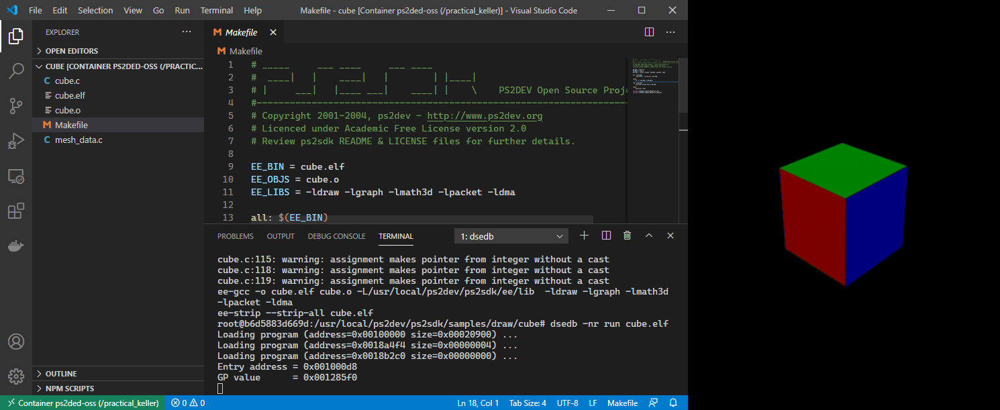

# PlayStation 2 DevEnv for Docker

A toolchain host for the [open-source PlayStation 2 SDK](https://github.com/ps2dev/ps2dev), using a [&#128279;Retail Debugging Startup Cart (PSX-Place)](https://www.psx-place.com/threads/retail-debugging-startup-card.14027/) for on-target debugging on retail systems.

**See also:** [**ps2ded-vscode**](https://github.com/islandcontroller/ps2ded-vscode), a VS Code Devcontainer for PS2DED

## System Requirements

- Docker Desktop (Windows host) or Docker Server (Linux host)
- Retail PlayStation 2 w/ Ethernet interface (tested on `SCPH-77004`)
- uLaunchELF (tested with v4.43a)

## Preparation

The buildscript will fetch the latest copy of the [PS2DEV](https://github.com/ps2dev/ps2dev) GitHub repository. Other third-party tools &ndash; such as the DSNET binaries &ndash; are hosted off-site, and need to be downloaded separately.

1. Download the DSNET tool set from the RDB project: [&#128279;PSX-Place **(dsnet-bin.7z)**](https://www.psx-place.com/threads/retail-debugging-startup-card.14027/)
2. Place the 7zip archive into the `install/` folder

### Retail Debugging Startup Cart (RDB-UIF)

1. Download the binaries from the RDB project: [&#128279;PSX-Place **(RDB-095-bin.7z)**](https://www.psx-place.com/threads/retail-debugging-startup-card.14027/)
2. Transfer the following files to your system, e.g. using uLaunchELF's FTP server. Place them in a new folder on your memory card, e.g. `mc0:/RDB/`
    - `RDB-UIF.elf`
    - `thmon.irx`

## Building

To build the Docker image, open a shell session inside the cloned repo folder, and run:

    docker build -t ps2ded-oss .

Due to limitations of the Docker build system, this will leave behind an untagged image of the builder stage, with a size of around 1 GB. This dangling image can be removed.

## Usage

The container provides access to the PlayStation 2 SDK compiler and debugger toolchain, as well as all related header files. The DSNET server can be accessed from other tools, similar to a *TOOL* PlayStation 2, via the exposed network port `8510`. In order to launch a new session, use:

    docker run -v <workspace>:/work -e PS2IP=<ipaddr> --rm -it ps2ded-oss

Load the *RDB-UIF* executable on your PlayStation and start the DSNET server by running the following command inside the container shell. The script will use the IP address specified in `$PS2IP`.

    start_dsnetm

The script will automatically start up an IOP module server, and dump the register contents of both processors to check the connection.

### Note on compatibility
There are compatibility issues between the open-source SDK and the *non-SCE* DSNET binaries. For example, `printf` outputs are not passed to the IOP in a way to be forwarded over the debug port. Software breakpoints have been observed to cause lock-up of the `dsedb` application. In general, the open-source PS2SDK is more optimized for use with their own debugger `ps2link`, and its supporting tools.

## Configuration

Use Docker environment variable arguments when launching a new container to configure the IP address of the target device:

    -e PS2IP=192.168.1.100